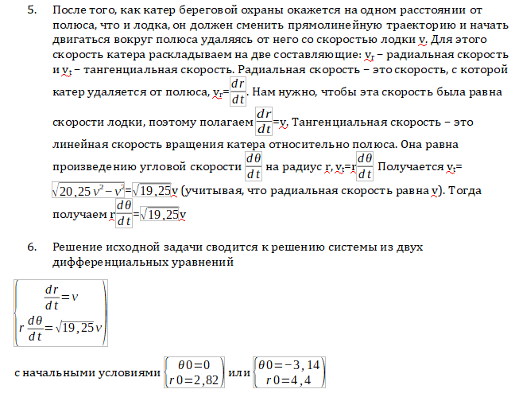
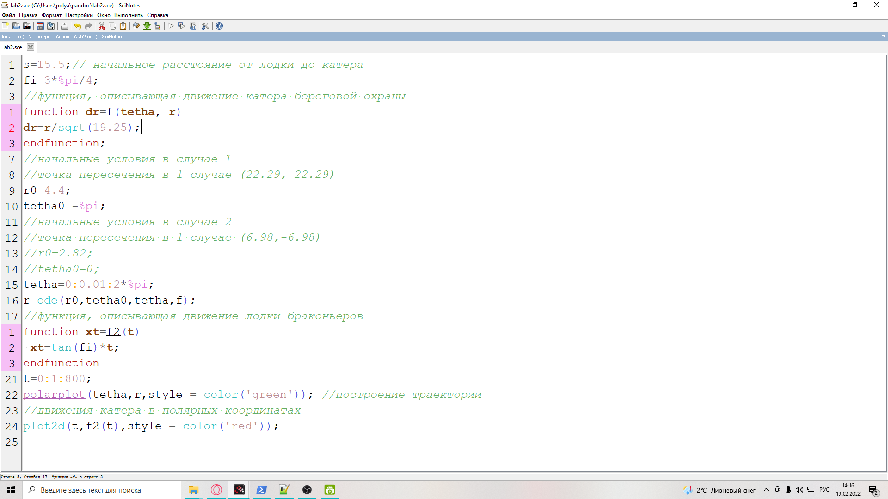

---
## Front matter
lang: ru-RU
title: Lab2 Задача о погоне
author: Поляков Иван Андреевич
institute: RUDN University, Moscow, Russian Federation
date: 2022, 19 February

## Formatting
toc: false
slide_level: 2
theme: metropolis
header-includes: 
 - \metroset{progressbar=frametitle,sectionpage=progressbar,numbering=fraction}
 - '\makeatletter'
 - '\beamer@ignorenonframefalse'
 - '\makeatother'
 - \usepackage[T2A]{fontenc}
aspectratio: 43
section-titles: true
---

# Цель работы

Научиться строить математические модели для решения задач.

# Выведение формул

{width=100%}

# Создание модели в Scilab

{width=100%}

